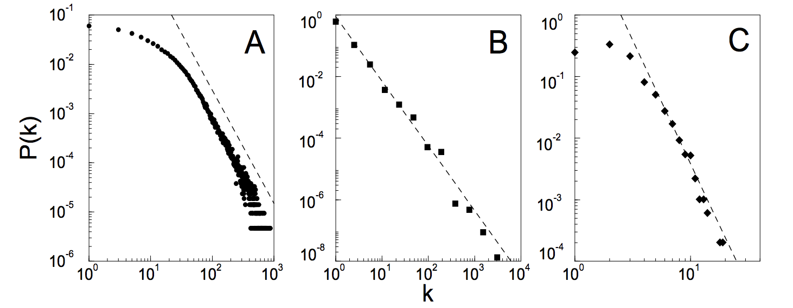
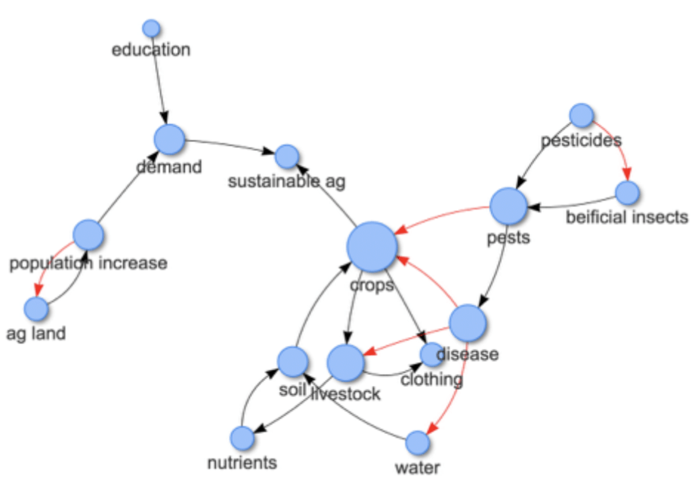
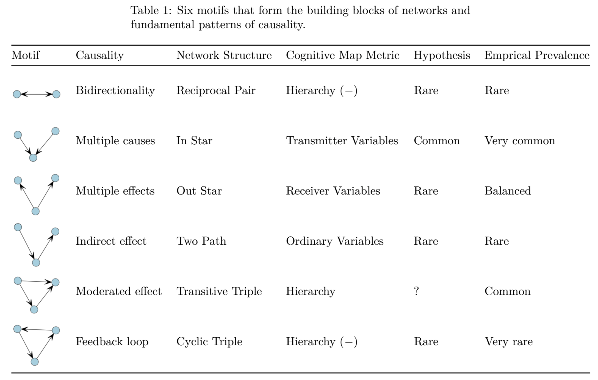
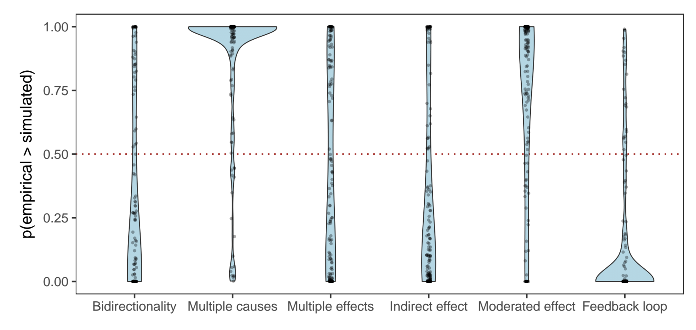
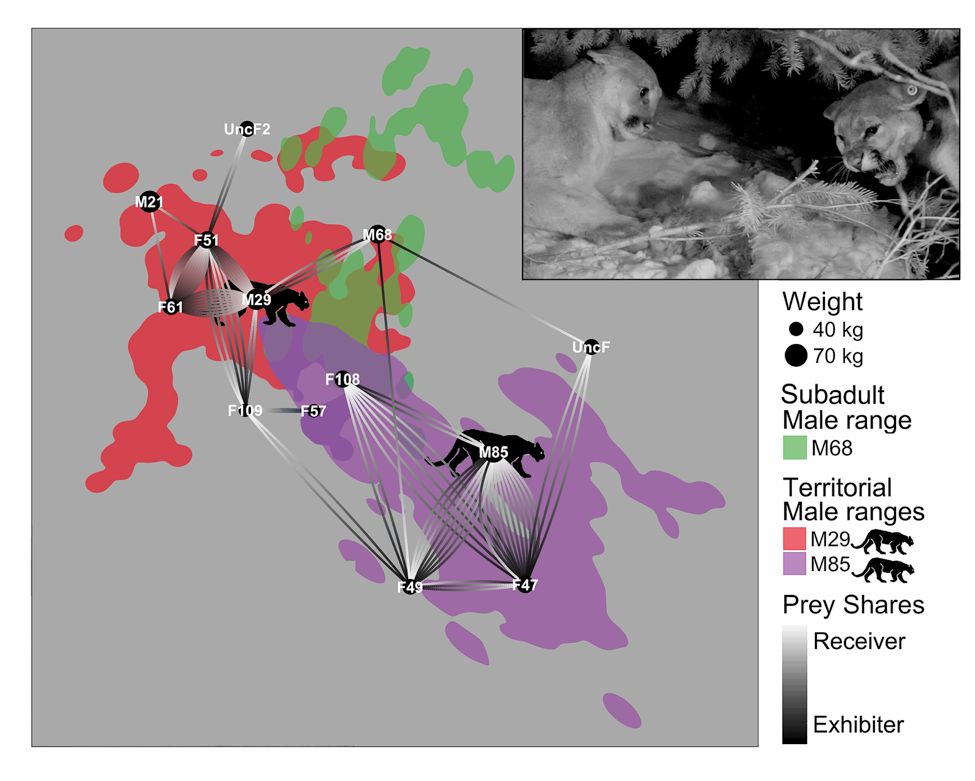

```{r setup, include = FALSE}
library(tidyverse)
library(knitr)
library(statnet)
library(netUtils)
source("../../../R/util.R")
opts_chunk$set(echo = FALSE, warning = FALSE, cache = TRUE, fig.asp = 1, fig.width = 2.5)
```


## Network Analysis: What, Why, and How { .white }


<p class="white">
Michael Levy  |  @ucdlevy  
SLC Data Science Meetup  
2017-08-23
</p>

## Agenda

1. What is a network?
1. Real-world examples
1. Network statistics
1. Real-world analyses
1. Tools

## What makes a network?

<div class="double">

<p class="double-flow">

```{r}
par(mar = rep(0, 4))
set.seed(856)
n <- netUtils::makeNetwork(8, .33) 
plot(n, vertex.cex = 3, displaylabels = TRUE, pad = .5)
```

</p><p class="double-flow">

```{r network parts, results="asis"}
data_frame(Points = c("nodes", "vertices", "actors"),
           Lines = c("links", "edges", "ties"),
           Tradition = c("CS", "math", "social science")) %>%
  kable()
```

</p>
</div>

## Some examples of networks

```{r examples, results = "asis"}
data_frame(Nodes = c("People", "Computers", "Cities", "Proteins", "Functions"),
           Edges = c("Friendship / Number of emails / Virus transmission", 
                     "Data transfer / Compatibility", 
                     "Highways / Migration volume / Gov't collaboration",
                     "Interact / Share sequence",
                     "Calls")) %>%
  kable()

```

# A few real-world examples...

## Facebook Friendships { .white }


## Contagion of Obsesity

<div class="double">
<p class="double-flow">

```{r, out.height = 300}
include_graphics("http://www.nejm.org/na101/home/literatum/publisher/mms/journals/content/nejm/2007/nejm_2007.357.issue-4/nejmsa066082/production/images/large/nejmsa066082_f1.jpeg")
```

<sub>Christakis & Fowler 2007</sub>

</p><p class="double-flow">

- Nodes = People   
    - Yellow = obese  
    - Green = non-obese
- Edges = Relationships
    - Purple = friendship or marriage  
    - Orange = related

</p>
</div>


## Scale Invariance

```{r scale free, out.height=250}


```

A = actor collaboration, B = www links, C = power stations

<sub>Barabasi & Albert 1999</sub>

## { .fullpage }

<div class="fullpage height">
```{r congress}
include_graphics("http://journals.plos.org/plosone/article/figure/image?size=large&id=10.1371/journal.pone.0123507.g002")
```
</div>

**Congressional Clustering**

<sub>Andris *et al.* 2015</sub>


## Protein-Cofactor-Disease Interactions

<div class="double">
<p class="double-flow">

```{r proteins, out.height = 300}
include_graphics("https://images.nature.com/w926/nature-assets/srep/2016/160118/srep19633/images_hires/srep19633-f2.jpg")
```

<sub>Scott-Boyer *et al.* 2016</sub>

</p><p class="double-flow">

```{r proteins 2, out.height = 350}
include_graphics("https://images.nature.com/w926/nature-assets/srep/2016/160118/srep19633/images_hires/srep19633-f3.jpg")
```

</p>
</div>

## Code Profiling


# Individual level statistics

## Centrality

```{r centrality, fig.width=8, fig.asp=.4}
set.seed(935761)
n <- makeNetwork(25, .1)
deg <- degree(n, gmode = "graph")
bet <- betweenness(n, gmode = "graph")
eig <- evcent(n, gmode = "graph")
vcex <- 5
par(mfrow = c(1, 3), cex.main = 1.5)
pos <- plot(n, vertex.col = makePal(deg), vertex.cex = vcex, main = "Degree")
plot(n, vertex.col = makePal(bet), vertex.cex = vcex, coord = pos, main = "Betweenness")
plot(n, vertex.col = makePal(eig), vertex.cex = vcex, coord = pos, main = "Eigenvector")
```

# Network level statistics

## Density

- Density = Fraction of possible edges present, $\in{[0, 1]}$
- Mean Degree = Average degree of nodes, $\in{[0, N]}$


```{r, fig.width=6, fig.asp = .5}
expand.grid(
  n = c(10, 100, 1000, 10000),
  density = seq(.01, 1, len = 100)
) %>%
  mutate(number_edges = density * n * (n - 1),
         mean_degree = number_edges / n) %>%
  ggplot(aes(x = density, y = mean_degree, color = factor(n))) +
  geom_line() +
  scale_y_log10() +
  annotation_logticks(sides = "l") +
  scale_color_brewer(name = "Number Nodes", palette = "Dark2") +
  guides(color = guide_legend(reverse = TRUE))
```


## Centralization

For centrality measure $C$ on vertex $v$:

$$Centralization = \sum_v{max(C(v))-C(v)}$$

Variance of centrality also reasonable

```{r, out.height="50%", out.width="50%"}

```

## Clustering coefficient

<div class="double">
<p class="double-flow">

```{r clustering}
set.seed(87654)
par(mar = rep(.5, 4))
makeNetwork(3, density = 1) %>%
  plot(edge.col = sapply(c(1, .35, 1), function(x) adjustcolor("black", x)), 
       edge.lwd = 20, vertex.cex = 10,
       vertex.col = c("lightblue", "darkblue", "lightblue"))
```

</p><p class="double-flow">

> - $\dfrac{3 \times triangles}{twopaths}$
> - Measure of how tightly bound neighborhoods are.


</p>
</div>

## Homophily

```{r, fig.width = 7, fig.asp = .6}
set.seed(543789)
par(mar = c(0, 0, 4, 0))
data("samplk")
grp_fct <- factor(samplk1 %v% "group")
grp_col <- RColorBrewer::brewer.pal(4, "Set1")[grp_fct]
co <- plot(samplk1, vertex.cex = 3, 
           vertex.col = grp_col,
           arrowhead.cex = 2, edge.col = adjustcolor("black", .4), main = "Sampson's Monks")
legend(x = "topright", legend = levels(grp_fct), fill = unique(grp_col))
```

## Modularity

```{r, fig.width = 7, fig.asp = .5}
set.seed(4783120)
# data("florentine")
# iN <- intergraph::asIgraph(samplk1)
iN <- igraph::graph_from_adjacency_matrix(samplk1[,], mode = "undirected")
eb <- igraph::cluster_edge_betweenness(iN)
fg <- igraph::cluster_fast_greedy(iN)
wt <- igraph::cluster_walktrap(iN)
sg <- igraph::cluster_leading_eigen(iN)

par(mar = c(0, 0, 2, 0), mfrow = c(2, 2))
plot(samplk1, vertex.cex = 3, arrowhead.cex = 2, pad = 0,
     coord = co, edge.col = adjustcolor("black", .4),
     vertex.col = eb$membership, 
     main = paste("Edge Betweenness:", round(igraph::modularity(eb), 3)))
plot(samplk1, vertex.cex = 3, arrowhead.cex = 2, pad = 0,
     coord = co, edge.col = adjustcolor("black", .4),
     vertex.col = fg$membership, 
     main = paste("Fast Greedy:", round(igraph::modularity(fg), 3)))
plot(samplk1, vertex.cex = 3, arrowhead.cex = 2, pad = 0,
     coord = co, edge.col = adjustcolor("black", .4),
     vertex.col = wt$membership, 
     main = paste("Walk Trap:", round(igraph::modularity(wt), 3)))
plot(samplk1, vertex.cex = 3, arrowhead.cex = 2, pad = 0,
     coord = co, edge.col = adjustcolor("black", .4),
     vertex.col = sg$membership, 
     main = paste("Spin Glass:", round(igraph::modularity(sg), 3)))
```

## Diameter

*Longest-shortest path between two nodes*

```{r, fig.width = 3.5}
par(mar = c(0, 0, 2, 0))
d <- igraph::get_diameter(iN)

igraph::E(iN)$color <- "grey"
igraph::E(iN)$width <- 1
igraph::E(iN, path=d)$color <- "red"
igraph::E(iN, path=d)$width <- 3

floN <- intergraph::asNetwork(iN)
plot(floN, vertex.cex = 3, vertex.col = "darkblue", coord = co, 
     edge.col = "color", edge.lwd = "width", main = "Diameter = 4")
```


## More Measures

> - Average path length
>     - Harmonic mean handles disconnected nodes
> - Connectedness
> - Hierarchy
> - Efficiency
> - Least-upperboundedness

## Variations

> - Valued/count edges
> - Directed edges
> - Bipartite networks
> - Trees
> - Dynamic networks
> - Dynamics on networks

## Case Studies

1. Viticulture management: Descriptive statistics
1. Mental models of sustainable agriculture: Conditional uniform random graph (CUG) tests
1. Pre-teen obesity: Network autocorrelation models (LNAM)
1. Mountain lion prey sharing: Exponential random graph models (ERGM)

# Viticulture management

## Three regional networks, three professional categories

```{r, out.width="100%"}
include_graphics("Fig1.tiff")
```

## Outreach professionals who grow are in charge

```{r, out.width = "60%"}
include_graphics("Fig2.tiff")
```

# Mental models of sustainable agriculture

## Network of perceived causal relationships

```{r, out.height = "100%"}

```

## Causal patterns as network motifs

```{r, out.width = "80%"}

```

## Representation of causal patterns vs. chance

```{r, out.width = '100%'}

```


# Pre-teen obesity

## 10-12 y.o. girls at obesity-intervention camp

```{r, out.width = "100%"}
include_graphics("https://raw.githubusercontent.com/michaellevy/obesity-networks/master/results/ActivityAndSnackingChange_NetworkPlots.png")
```

## Evidence for social support but not contagion

LNAM of snack quality change
```
        Estimate Std. Error Z value Pr(>|z|)  
age     -0.08404    0.08233  -1.021   0.3074  
friends  0.46449    0.26427   1.758   0.0788 .
rho1.1  -0.04893    0.23314  -0.210   0.8338  
```

LNAM of physical activity change
```
        Estimate Std. Error Z value Pr(>|z|)   
age       5.8990     2.0673   2.853  0.00432 **
friends  10.4995     6.2888   1.670  0.09501 . 
rho1.1   -0.2564     0.2113  -1.213  0.22511   
```


# Mountain lion prey sharing

## { .fullpage }




## { .fullpage }

Statistical</br>evidence</br>of social</br>structure

<div class="fullpage height">

</div>


# Tools

## R

- igraph
- statnet (network, sna, ergm, networkDynamic): Statistical analysis of networks (ERGM, CUG, lnam, etc.)
- RSiena: Statistical models on temporal data
- visNetwork: Dynamic visualization from R via D3

## { .fullpage }

<div class="fullpage height">
```{r visNetwork demo, fig.width = 8, fig.asp = .5}
library(visNetwork)
load("forVN.RDA")
nodes <- select(nodes, id, label, title, size, image)
edges <- ungroup(edges)
visNetwork(nodes, edges) %>%
  visNodes(
    shape = "image", 
    size = 32
    , shadow = list(enabled = TRUE, size = 10)
  ) %>%
  visEdges(
    arrows = 'to', 
    shadow = TRUE,
    color = list(opacity = .7, highlight = 'black', selectionWidth = 0)
  )  %>%
  visOptions(
    highlightNearest = TRUE
    , nodesIdSelection = TRUE
  ) 

```
</div>

## Python

- networkX
- igraph
- ???

## GUI

- Gephi: Open-source visualization and analysis

- Pajek
- ORA

## More

- For a comprehensive tool list, see the curated Awesome Network Analysis list: https://github.com/briatte/awesome-network-analysis
- Feel free to get in touch with me: 
    - Twitter: @ucdlevy
    - GitHub: @michaellevy
